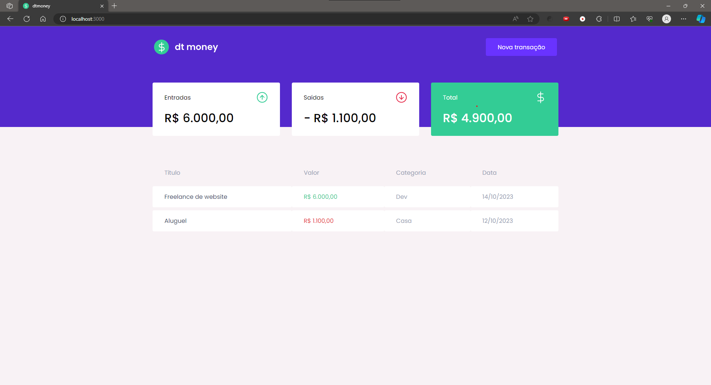

# :clipboard: Índice

- [Sobre](#sobre)
- [Tecnologias Utilizadas](#tecnologias)
- [Como Executar o Projeto](#executar)
- [Como Contribuir](#contribuir)
- [License](#license)

---

<a id="sobre"></a>

# :scroll: Sobre

 O <b>DTMoney</b> é uma aplicação Web desenvolvida durante a trilha do Ignite da Rocktseat.
<div align="center">
    
</div>

 ---

 <a id="tecnologias"></a>

 # :rocket: Tecnologias Utilizadas

 O projeto foi desenvolvido em:

 - ReactJS
 - Styled Components
 - Typescript
 - MirageJs
 - Axios

 ---

 <a id="executar">

# :computer: Como Executar o projeto

```bash
    # Clonar o repositório
    git clone https://github.com/pereirathiago/dtmoney-ignite.git

    # Entrar no projeto
    cd dtmoney-ignite

    # Baixar as dependências
    npm install

    # Executar o server
    npm run start
```
Depois disso abra seu navegador favorito e entre na URL "http://localhost:3000"

---

<a id="contribuir"></a>

## :recycle: Como contribuir

- Faça um Fork desse projeto
- Crie uma branch com sua feature
- Commit suas mudanças
- Push a sua Branch

---

<a id="license"><a>

## :memo: License

Esse projeto está sob a licença MIT. Veja o arquivo [LICENSE](LICENSE) para mais detalhes.

---

<p align="center">
    Feito com 💜 por Thiago Pereira
</p>
